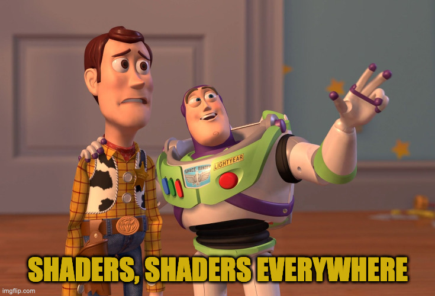

# ShadersEverywhere
Collections of shaders I made for practice and fun :)  

- Original Ideas are shaders I created with no references, some have been already done for sure but I wasn't aware, I swear
- Inspiration are shaders I made but I used references (from games, ShaderToy, ...) and my goal is to look the same
- Utilities are functions or set of functions that can be used for shaders

I test my shaders on [The Book Of Shaders](http://editor.thebookofshaders.com/) or [Shader Toy](https://www.shadertoy.com/) as Aros. 
